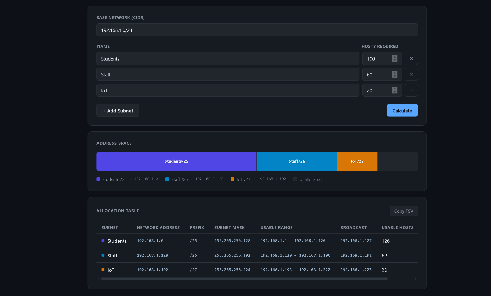

# Subnet Visualizer

A client-side VLSM subnet planning tool — enter a base network and host requirements, get an allocation table and proportional address-space visualisation.

**[Live demo →](https://subnet-visualizer-three.vercel.app)**

---

## Screenshot



---

## How VLSM allocation works

Variable Length Subnet Masking fits multiple subnets of different sizes into a single address block without wasting space.

1. **Largest-first sorting** — requirements are sorted by host count descending before allocation begins. This avoids alignment gaps that would occur if a large subnet had to skip over space already reserved by a smaller one.
2. **Power-of-2 block sizing** — each subnet is assigned the smallest block whose size is a power of 2. A block of size *2ⁿ* has a natural alignment: it can only start at addresses that are multiples of *2ⁿ*, so no padding is needed between consecutive allocations.
3. **hosts + 2 rule** — the required block size is the smallest power of 2 that is ≥ *hosts + 2*, reserving one address for the network identifier and one for the broadcast address. A request for 60 hosts needs 62 usable addresses → minimum block 64 → `/26`.

---

## Tech stack

| | |
|---|---|
| **UI** | React 18 + TypeScript |
| **Build** | Vite 6 |
| **Tests** | Vitest 2 — 14 unit tests covering normal allocation, exact-fit cases, out-of-space errors, and edge cases |
| **Deploy** | Vercel (static, no backend) |

---

## Local setup

```bash
npm install
npm run dev      # http://localhost:5173
npm test         # run the 14 unit tests once
npm run test:watch  # re-run on file changes
```
